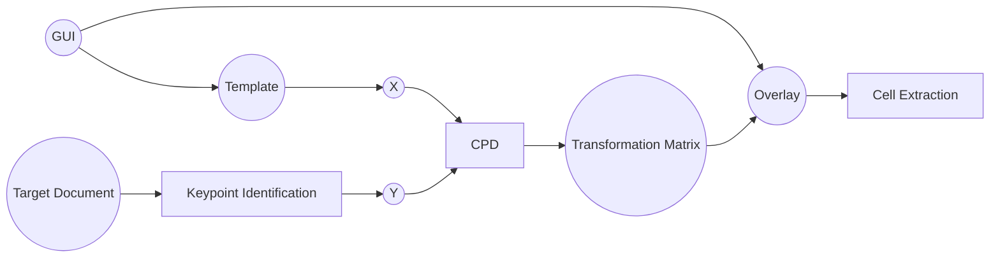

"""
Created on May 3rd, 2021
@author: sa-cmd + sa-cew
"""

# DocCPD (tmp name)

Document CPD API development

### Preventing Rot:
[ ] - Replace numpy line definitions with a namedtuple
[ ] - n_keypoints specification in Template has duplication
[ ] - A way to fit Overlay and Template under a common superclass?

### TODO:

[ ] - How to make sure that each Template point corresponds to the identified points on the target image?
[ ] - How should the Overlay be represented? An image, dictionary, object?
[ ] - Distribution of the overlay cells to the respective folders

[ ] - Create a GUI for template creation
	[ ] - Make height and width requirements a function of the output such that it does not
		have to be manually specified

### Pipeline Overview

1. Find a neat example (a template) of the document type to be segmented. 
2. Locate a point cloud (that we denote $X$) on the template that CPD will identify the mapping for (will be done automatically).
3. Specify an overlay of the document fields of interest (using our GUI --> JSON or XML? 🤔).
4. For every document (the target) of the same type as the template, CPD will identify the mapping $\phi : X \rightarrow Y$ where $X$ is the template point cloud and $Y$ is the point cloud on the target document.
5. Apply $\phi$ to the respective overlay of the target.
6. Extract the transformed cell coordinates. 

### API Overview

## Webscraping all DK 1916 census files
- Based on Emil's index. Documented here: W:\BDADSharedData\Spanish Flu\Denmark\census1916\metadata-census-1916\

## Web-crawling scripts 
- ./web_scraping/Webcrawl_FT1916_{copenhagen,koebsteder,landdistrikter}.py

## Make target images
- ./target_masks/Generating_targetMask.py

## Scripts for CPD (in develop mode)
- ./main_cpd_1916DKCensus_development.py
